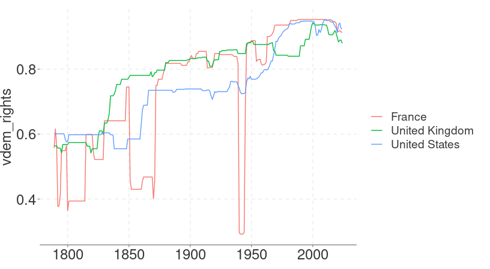

owidR
================

<!-- badges: start -->


[](https://CRAN.R-project.org/package=owidR)
[](https://github.com/piersyork/owidR/actions/workflows/R-CMD-check.yaml)
<!-- badges: end -->

This package acts as an interface to [Our World in
Data](https://ourworldindata.org/) datasets, allowing for an easy way to
search through data used in over 3,000 charts and load them into the R
environment.

## Installation

To install from CRAN:

``` r
install.packages("owidR")
```

To install the development version from GitHub:

``` r
devtools::install_github("piersyork/owidR")
```

## Using the package

The main function in owidR is `owid()`, which takes a chart id and
returns a data.table of the corresponding OWID dataset. To search for
chart ids you can use `owid_search()` to list all the chart ids that
match a keyword or regular expression.

## Example

Lets use the core functions to get data on how human rights have changed
over time. First by searching for charts on human rights.

``` r
library(owidR)

owid_search("human rights")
##      chart_id                                                                   
## [1,] "human-rights-index-vs-electoral-democracy-index"                          
## [2,] "cases-of-killed-human-rights-defenders-journalists-trade-unionists"       
## [3,] "countries-with-independent-national-human-rights-institution"             
## [4,] "distribution-human-rights-index-vdem"                                     
## [5,] "human-rights-index-vdem"                                                  
## [6,] "human-rights-index-population-weighted"                                   
## [7,] "human-rights-index-vs-gdp-per-capita"                                     
## [8,] "share-countries-accredited-independent-national-human-rights-institutions"
##      title                                                                              
## [1,] "Human rights index vs. electoral democracy index"                                 
## [2,] "Confirmed killings of human rights defenders, journalists and trade unionists"    
## [3,] "Countries with accredited independent national human rights institutions"         
## [4,] "Distribution of human rights index"                                               
## [5,] "Human rights index"                                                               
## [6,] "Human rights index"                                                               
## [7,] "Human rights index vs. GDP per capita"                                            
## [8,] "Share of countries with accredited independent national human rights institutions"
```

Let’s use the v-dem human rights index dataset.

``` r

rights <- owid("human-rights-index-vdem")

rights
## Key: <entity, code, year>
##             entity   code  year civ_libs_vdem_owid civ_libs_vdem_high_owid
##             <char> <char> <int>              <num>                   <num>
##     1: Afghanistan    AFG  1789              0.125                   0.169
##     2: Afghanistan    AFG  1790              0.125                   0.169
##     3: Afghanistan    AFG  1791              0.125                   0.169
##     4: Afghanistan    AFG  1792              0.125                   0.169
##     5: Afghanistan    AFG  1793              0.125                   0.169
##    ---                                                                    
## 33373:    Zimbabwe    ZWE  2018              0.428                   0.473
## 33374:    Zimbabwe    ZWE  2019              0.403                   0.456
## 33375:    Zimbabwe    ZWE  2020              0.413                   0.469
## 33376:    Zimbabwe    ZWE  2021              0.395                   0.443
## 33377:    Zimbabwe    ZWE  2022              0.388                   0.432
##        civ_libs_vdem_low_owid
##                         <num>
##     1:                  0.089
##     2:                  0.089
##     3:                  0.089
##     4:                  0.089
##     5:                  0.089
##    ---                       
## 33373:                  0.381
## 33374:                  0.361
## 33375:                  0.373
## 33376:                  0.344
## 33377:                  0.331
```

ggplot2 makes it easy to visualise our data.

``` r
library(ggplot2)
library(dplyr)

rights |> 
  filter(entity %in% c("United Kingdom", "France", "United States")) |> 
  ggplot(aes(year, civ_libs_vdem_owid, colour = entity)) +
  geom_line()
```



## COVID-19 Data

You can quickly download world covid-19 data, including vaccination
rates, using `owid_covid()`.

``` r
covid <- owid_covid()

str(covid)
## Classes 'owid', 'data.table' and 'data.frame':   351765 obs. of  67 variables:
##  $ iso_code                                  : chr  "AFG" "AFG" "AFG" "AFG" ...
##  $ continent                                 : chr  "Asia" "Asia" "Asia" "Asia" ...
##  $ location                                  : chr  "Afghanistan" "Afghanistan" "Afghanistan" "Afghanistan" ...
##  $ date                                      : IDate, format: "2020-01-03" "2020-01-04" ...
##  $ total_cases                               : num  NA NA NA NA NA NA NA NA NA NA ...
##  $ new_cases                                 : num  0 0 0 0 0 0 0 0 0 0 ...
##  $ new_cases_smoothed                        : num  NA NA NA NA NA 0 0 0 0 0 ...
##  $ total_deaths                              : num  NA NA NA NA NA NA NA NA NA NA ...
##  $ new_deaths                                : num  0 0 0 0 0 0 0 0 0 0 ...
##  $ new_deaths_smoothed                       : num  NA NA NA NA NA 0 0 0 0 0 ...
##  $ total_cases_per_million                   : num  NA NA NA NA NA NA NA NA NA NA ...
##  $ new_cases_per_million                     : num  0 0 0 0 0 0 0 0 0 0 ...
##  $ new_cases_smoothed_per_million            : num  NA NA NA NA NA 0 0 0 0 0 ...
##  $ total_deaths_per_million                  : num  NA NA NA NA NA NA NA NA NA NA ...
##  $ new_deaths_per_million                    : num  0 0 0 0 0 0 0 0 0 0 ...
##  $ new_deaths_smoothed_per_million           : num  NA NA NA NA NA 0 0 0 0 0 ...
##  $ reproduction_rate                         : num  NA NA NA NA NA NA NA NA NA NA ...
##  $ icu_patients                              : num  NA NA NA NA NA NA NA NA NA NA ...
##  $ icu_patients_per_million                  : num  NA NA NA NA NA NA NA NA NA NA ...
##  $ hosp_patients                             : num  NA NA NA NA NA NA NA NA NA NA ...
##  $ hosp_patients_per_million                 : num  NA NA NA NA NA NA NA NA NA NA ...
##  $ weekly_icu_admissions                     : num  NA NA NA NA NA NA NA NA NA NA ...
##  $ weekly_icu_admissions_per_million         : num  NA NA NA NA NA NA NA NA NA NA ...
##  $ weekly_hosp_admissions                    : num  NA NA NA NA NA NA NA NA NA NA ...
##  $ weekly_hosp_admissions_per_million        : num  NA NA NA NA NA NA NA NA NA NA ...
##  $ total_tests                               : num  NA NA NA NA NA NA NA NA NA NA ...
##  $ new_tests                                 : num  NA NA NA NA NA NA NA NA NA NA ...
##  $ total_tests_per_thousand                  : num  NA NA NA NA NA NA NA NA NA NA ...
##  $ new_tests_per_thousand                    : num  NA NA NA NA NA NA NA NA NA NA ...
##  $ new_tests_smoothed                        : num  NA NA NA NA NA NA NA NA NA NA ...
##  $ new_tests_smoothed_per_thousand           : num  NA NA NA NA NA NA NA NA NA NA ...
##  $ positive_rate                             : num  NA NA NA NA NA NA NA NA NA NA ...
##  $ tests_per_case                            : num  NA NA NA NA NA NA NA NA NA NA ...
##  $ tests_units                               : chr  "" "" "" "" ...
##  $ total_vaccinations                        : num  NA NA NA NA NA NA NA NA NA NA ...
##  $ people_vaccinated                         : num  NA NA NA NA NA NA NA NA NA NA ...
##  $ people_fully_vaccinated                   : num  NA NA NA NA NA NA NA NA NA NA ...
##  $ total_boosters                            : num  NA NA NA NA NA NA NA NA NA NA ...
##  $ new_vaccinations                          : num  NA NA NA NA NA NA NA NA NA NA ...
##  $ new_vaccinations_smoothed                 : num  NA NA NA NA NA NA NA NA NA NA ...
##  $ total_vaccinations_per_hundred            : num  NA NA NA NA NA NA NA NA NA NA ...
##  $ people_vaccinated_per_hundred             : num  NA NA NA NA NA NA NA NA NA NA ...
##  $ people_fully_vaccinated_per_hundred       : num  NA NA NA NA NA NA NA NA NA NA ...
##  $ total_boosters_per_hundred                : num  NA NA NA NA NA NA NA NA NA NA ...
##  $ new_vaccinations_smoothed_per_million     : num  NA NA NA NA NA NA NA NA NA NA ...
##  $ new_people_vaccinated_smoothed            : num  NA NA NA NA NA NA NA NA NA NA ...
##  $ new_people_vaccinated_smoothed_per_hundred: num  NA NA NA NA NA NA NA NA NA NA ...
##  $ stringency_index                          : num  0 0 0 0 0 0 0 0 0 0 ...
##  $ population_density                        : num  54.4 54.4 54.4 54.4 54.4 ...
##  $ median_age                                : num  18.6 18.6 18.6 18.6 18.6 18.6 18.6 18.6 18.6 18.6 ...
##  $ aged_65_older                             : num  2.58 2.58 2.58 2.58 2.58 ...
##  $ aged_70_older                             : num  1.34 1.34 1.34 1.34 1.34 ...
##  $ gdp_per_capita                            : num  1804 1804 1804 1804 1804 ...
##  $ extreme_poverty                           : num  NA NA NA NA NA NA NA NA NA NA ...
##  $ cardiovasc_death_rate                     : num  597 597 597 597 597 ...
##  $ diabetes_prevalence                       : num  9.59 9.59 9.59 9.59 9.59 9.59 9.59 9.59 9.59 9.59 ...
##  $ female_smokers                            : num  NA NA NA NA NA NA NA NA NA NA ...
##  $ male_smokers                              : num  NA NA NA NA NA NA NA NA NA NA ...
##  $ handwashing_facilities                    : num  37.7 37.7 37.7 37.7 37.7 ...
##  $ hospital_beds_per_thousand                : num  0.5 0.5 0.5 0.5 0.5 0.5 0.5 0.5 0.5 0.5 ...
##  $ life_expectancy                           : num  64.8 64.8 64.8 64.8 64.8 ...
##  $ human_development_index                   : num  0.511 0.511 0.511 0.511 0.511 0.511 0.511 0.511 0.511 0.511 ...
##  $ population                                : num  41128772 41128772 41128772 41128772 41128772 ...
##  $ excess_mortality_cumulative_absolute      : num  NA NA NA NA NA NA NA NA NA NA ...
##  $ excess_mortality_cumulative               : num  NA NA NA NA NA NA NA NA NA NA ...
##  $ excess_mortality                          : num  NA NA NA NA NA NA NA NA NA NA ...
##  $ excess_mortality_cumulative_per_million   : num  NA NA NA NA NA NA NA NA NA NA ...
##  - attr(*, ".internal.selfref")=<externalptr>
```

## To-do

- [ ] Add function to load multiple country datasets into one dataframe
- [ ] Add caching of data (inc. backend)
- [x] Remove interactive plotting to reduce dependencies
- [ ] Create way to import owid explorers
