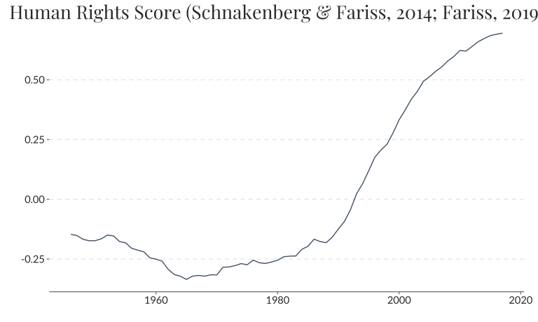
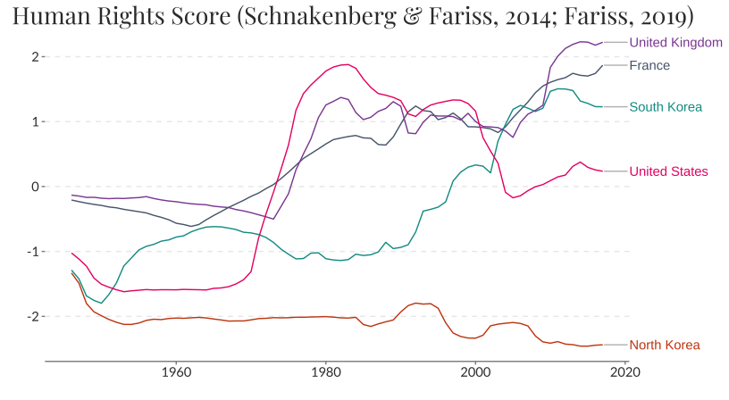
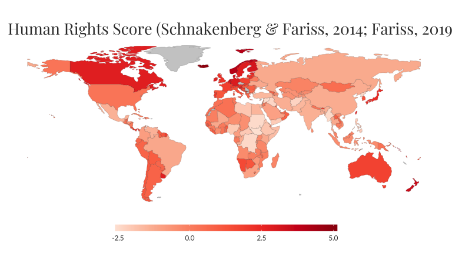

owidR
================
Piers York

<!-- badges: start -->


[](https://CRAN.R-project.org/package=owidR)
[](https://github.com/piersyork/owidR/actions)
<!-- badges: end -->

This package acts as an interface to [Our World in
Data](https://ourworldindata.org/) datasets, allowing for an easy way to
search through data used in over 3,000 charts and load them into the R
environment.

## Installation

To install from CRAN:

``` r
install.packages("owidR")
```

To install the development version from GitHub:

``` r
devtools::install_github("piersyork/owidR")
```

## Using the package

The main function in owidR is `owid()`, which takes a chart id and
returns a tibble (dataframe) of the corresponding OWID dataset. To
search for chart ids you can use `owid_search()` to list all the chart
ids that match a keyword or regular expression.

## Example

Lets use the core functions to get data on how human rights have changed
over time. First by searching for charts on human rights.

``` r
library(owidR)

owid_search("human rights")
##      titles                                                                                                                                        
## [1,] "Human Rights Score vs. Political regime type"                                                                                                
## [2,] "Political regime type vs. Human Rights Score"                                                                                                
## [3,] "Countries with National Human Rights Institutions in compliance with the Paris Principles"                                                   
## [4,] "Human Rights Score vs. GDP per capita"                                                                                                       
## [5,] "Human Rights Scores"                                                                                                                         
## [6,] "Human Rights Violations"                                                                                                                     
## [7,] "Proportion of countries that applied for accreditation as independent National Human Rights Institutions in compliance with Paris Principles"
##      chart_id                                                      
## [1,] "human-rights-score-vs-political-regime-type"                 
## [2,] "political-regime-type-vs-human-rights-score"                 
## [3,] "countries-in-compliance-with-paris-principles"               
## [4,] "human-rights-score-vs-gdp-per-capita"                        
## [5,] "human-rights-scores"                                         
## [6,] "human-rights-violations"                                     
## [7,] "countries-that-applied-for-accreditation-in-paris-principles"
```

Let’s use the human rights scores dataset.

``` r
rights <- owid("human-rights-scores")

rights
## # A tibble: 11,717 × 4
##    entity      code   year `Human Rights Score (Schnakenberg & Fariss, 2014; Fa…
##  * <chr>       <chr> <int>                                                 <dbl>
##  1 Afghanistan AFG    1946                                                 0.690
##  2 Afghanistan AFG    1947                                                 0.740
##  3 Afghanistan AFG    1948                                                 0.787
##  4 Afghanistan AFG    1949                                                 0.817
##  5 Afghanistan AFG    1950                                                 0.851
##  6 Afghanistan AFG    1951                                                 0.909
##  7 Afghanistan AFG    1952                                                 0.938
##  8 Afghanistan AFG    1953                                                 0.988
##  9 Afghanistan AFG    1954                                                 1.01 
## 10 Afghanistan AFG    1955                                                 1.01 
## # … with 11,707 more rows
```

`owid_plot()` makes it easy to visualise an owid dataset, plotting the
first value column of an owid dataset. By default the mean score across
all countries is plotted.

``` r
owid_plot(rights)
## Loading required namespace: showtext
```



Use `summarise = FALSE` to show individual countries instead of the mean
score. Unless a vector of entities is specified using the `filter`
argument 9 random entities will be plotted. If the data is not a
time-series then a bar chart of the entities values will be plotted.

``` r
owid_plot(rights, summarise = FALSE, filter = c("North Korea", "South Korea", "France", "United Kingdom", "United States"))
```



`owid_map()` makes it easy to create a choropleth world map of datasets
that contain country level data. The Entities of the owid data must be
country names. By default the most recent year will be plotted, use the
`year` argument to plot a different year.

``` r
owid_map(rights)
```



## Creating Our World in Data style interactive charts

**Warning:** The grapher functionality has now moved to
<https://github.com/piersyork/owidGrapher>. This both to simplify the
owidR experience and also because the grapher is very unstable.

`owid_grapher()` creates graphs in the style of Our World in Data. The
output of `owid_grapher()` can be piped into `grapher_line()` to add a
line graph, into `grapher_map()` to add a world map, and into
`grapher_labels()` to add labels to the graph. The graph is shown in the
RStudio viewer, or when called in an RMarkdown html document is
displayed within the document. Currently this isn’t implemented as an
htmlwidget and requires an internet connection to function.

``` r
rights %>% 
  owid_grapher(x = year, y = `Human Rights Score (Schnakenberg & Fariss, 2014; Fariss, 2019)`, 
               entity = entity) %>% 
  grapher_line(selected = c("North Korea", "South Korea", "France", "United Kingdom", "United States")) %>% 
  grapher_map(palette = "RdYlGn", bins = c(-2, 0, 2, 4)) %>% 
  grapher_labels(title = "Human Rights Scores",
                 subtitle = "Values range from around -3.8 to around 5.4 (the higher the better)",
                 source = "Our World in Data; Schnakenberg and Fariss (2014); Fariss (2019)")
```
