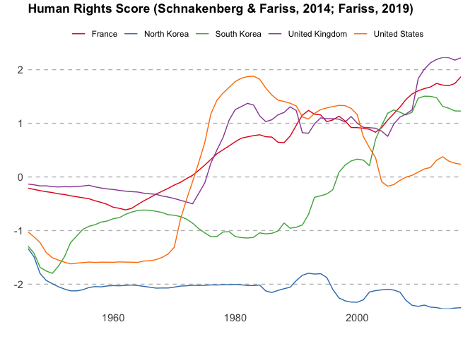
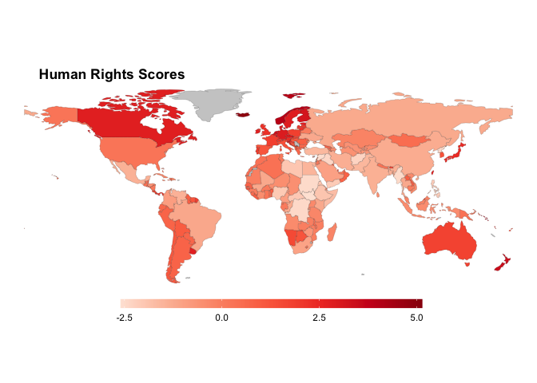

owidR
================
Piers York

This package acts as an interface to the [Our World in
Data](https://ourworldindata.org/) datasets [GitHub
repository](https://github.com/owid/owid-datasets), allowing for easy
way to search from a list of almost 1,000 datasets and load them into
the R environment.

## Installation

``` r
devtools::install_github("piersyork/owidR")
```

## Using the package

There are three core functions in the `owidR` package.
`owid_get_datasets()` returns a tibble of all available Our World in
Data datasets alongside a generated id. `owid_search()` makes it easy to
search through the available datasets, using either a keyword or a
regular expression. `owid()` takes an id and returns the corresponding
dataset.

### Example

Lets use the core functions to get data on how human rights have changed
over time.

First loading the tibble of datasets.

``` r
ds <- owid_get_datasets()
```

Then searching for datesets about human rights.

``` r
owid_search(ds, "human rights")
## # A tibble: 3 x 2
##      id title                                                                   
##   <int> <chr>                                                                   
## 1   309 Fund for Peace – Fragile States Index (Human Rights Dimension)          
## 2   436 Human Rights Protection Score – Christopher Farris (2014) and Keith Sch…
## 3   437 Human Rights Scores – Schnakenberg and Fariss (2014), Fariss (2019)
```

Let’s use the Schnakenberg and Fariss dataset.

``` r
id <- owid_search(ds, "Human Rights Scores – Schnakenberg and Fariss")$id

rights <- owid(id, ds)
## Human Rights Scores – Schnakenberg and Fariss (2014), Fariss (2019)

rights
## # A tibble: 11,717 x 3
##    Entity       Year `Human Rights Scores`
##  * <chr>       <dbl>                 <dbl>
##  1 Afghanistan  1946                 0.690
##  2 Afghanistan  1947                 0.740
##  3 Afghanistan  1948                 0.787
##  4 Afghanistan  1949                 0.817
##  5 Afghanistan  1950                 0.851
##  6 Afghanistan  1951                 0.909
##  7 Afghanistan  1952                 0.938
##  8 Afghanistan  1953                 0.988
##  9 Afghanistan  1954                 1.01 
## 10 Afghanistan  1955                 1.01 
## # … with 11,707 more rows
```

`owid_plot()` makes it easy to visualise an owid dataset, plotting the
first value column of an owid dataset. By default the mean score across
all countries is plotted.

``` r
owid_plot(rights)
```

<!-- -->

Use `summarise = FALSE` to show individual countries instead of the mean
score. Unless a vector of entities is specified using the `filter`
argument 9 random entities will be plotted. If the data is not a
time-series then a bar chart of the entities values will be plotted.

``` r
owid_plot(rights, summarise = FALSE, filter = c("North Korea", "South Korea", "France", "United Kingdom", "United States"))
```

<!-- -->

`owid_map()` makes it easy to create a choropleth world map of datasets
that contain country level data. The Entities of the owid data must be
country names.

``` r
owid_map(rights)
```

<!-- -->
